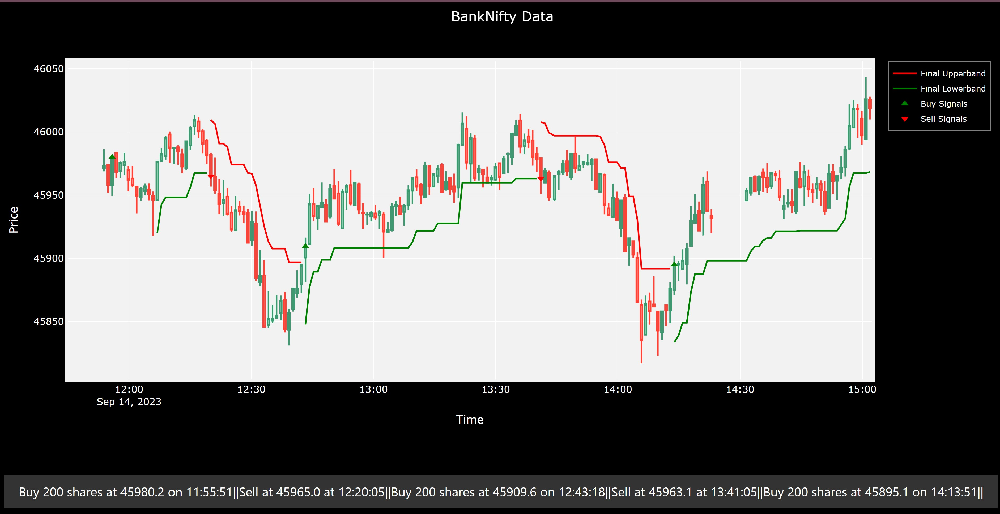

# Supertrend Indicator Backtesting and Live Data Analysis

This project consists of two parts: historical data backtesting using the Supertrend indicator and Chopiness Index with data from Yahoo Finance and live data plotting and Supertrend calculation for market entry and exit using the Kotak Neo API.

## Disclaimer

This financial analysis and visualization tool is provided for educational and informational purposes only. It is not intended to be used as financial advice or to make actual financial decisions. 

Please be aware that trading and investing in financial markets involve significant risks, and past performance is not indicative of future results. Before making any financial decisions, consult with a qualified financial advisor, conduct your own research, and consider your individual financial situation and risk tolerance.

The authors and contributors of this tool do not guarantee the accuracy or completeness of the data and analysis presented, and they are not responsible for any financial losses or gains that may result from the use of this tool. Use this tool at your own discretion and risk.

## Part 1: Historical Data Backtesting

### Overview

The first part of this project focuses on backtesting the Supertrend indicator using historical price data obtained from Yahoo Finance. It allows you to assess the performance of the Supertrend indicator in combination with the Chopiness Index on historical data and gain insights into its effectiveness as a trading tool.

### Features

- **Customizable Parameters**: Users can adjust the Supertrend parameters, such as the ATR period and multiplier, to fine-tune the indicator's behavior.

- **Interactive Candlestick Chart**: The project provides an interactive candlestick chart that displays historical price data along with the indicator signals.

- **Buy/Sell Signals**: Users can visualize buy and sell signals generated by the indicators on the historical data chart.

- **Performance Analysis**: The application allows users to evaluate the indicator's performance by analyzing historical trades and returns.

### Getting Started

1. **Clone the Repository**:

   Clone this GitHub repository to your local machine:

   ```bash
   git clone https://github.com/LakshGehani/Indicator-Tester.git
   ```

2. **Navigate to the Project Directory**:

   ```bash
   cd historical-data
   ```

3. **Run the Application**:

   Execute the following command to start the Supertrend Backtesting application:

   ```bash
   python backtesting_data.py
   ```

4. **Access the Dashboard**:

   Open your web browser and go to [http://localhost:8050](http://localhost:8050). You will see the interactive dashboard for historical data analysis.

5. **Experiment with Parameters**:

   - Select the Supertrend parameters (ATR period and multiplier).
   - Load historical price data from Yahoo Finance or use custom datasets.
   - Observe the Supertrend indicator signals and analyze performance.

## Part 2: Live Data Plotting and Analysis

### Overview

The second part of this project focuses on plotting live market data and calculating the Supertrend indicator in real-time using the Kotak Neo API. It allows you to monitor market conditions and identify potential entry and exit points based on the Supertrend indicator.

### Features

- **Live Data Plotting**: The application continuously fetches live market data from the Kotak Neo API and plots it in real-time.

- **Real-time Supertrend Calculation**: The Supertrend indicator is calculated on live data, and buy/sell signals are generated accordingly.

- **Interactive Chart**: A real-time candlestick chart displays live price data along with the Supertrend indicator.

- **Market Entry and Exit**: Users can use the real-time Supertrend signals to make informed decisions about entering or exiting the market.

### Getting Started


Before running the main application, you need to fetch financial market data and store it in your MySQL database. Follow these steps to do so:

1. Open your command-line interface (CLI).

2. Navigate to the project directory if you're not already there:

   ```bash
   cd /path/to/repository/live-data
   
2. **Start the websocket**:

   ```bash
   python fetch.py
   ```

4. **Open your code editor and run the application**:

   Execute the following command to start the Live Data Analysis application:

   ```bash
   python app.py
   ```

3. **Access the Live Chart**:

   Open your web browser and go to [http://localhost:8050](http://localhost:8050). You will see the real-time candlestick chart with the Supertrend indicator.
   

5. **Market Monitoring**:

   - Observe live price data and Supertrend signals.
   - Use the real-time data for market analysis and decision-making.

## Customization

You can customize and extend both parts of the project as per your requirements:

- **Adding New Features**: You can add additional technical indicators, data sources, or trading strategies to enhance the functionality.

- **User Interface**: Customize the user interface and layout to suit your preferences and requirements.

- **Integration with Other APIs**: Extend the project by integrating with other financial data providers or trading platforms.

## Contributing

Contributions to this project are welcome! If you have ideas for improvements or new features, feel free to open issues or submit pull requests.

## License

This project is licensed under the MIT License. See the [LICENSE](LICENSE) file for details.

## Acknowledgments

- This project leverages the power of Python, Dash, Plotly, and financial APIs to provide valuable insights and real-time market analysis.

Enjoy using this Supertrend Backtesting and Live Data Analysis tool for your financial analysis and trading needs!
